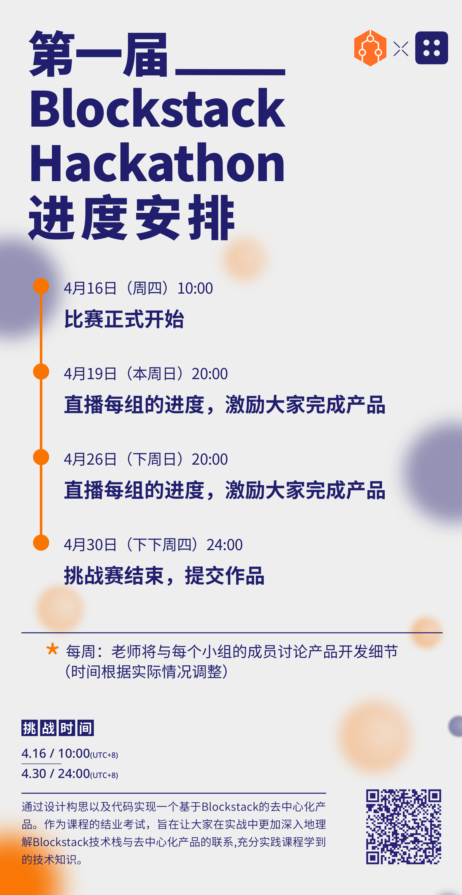

# Blockstack 黑客马拉松

## 黑客马拉松题目

使用Blockstack技术栈开发保护用户隐私的去中心化产品

## 题目要求

- 使用 Blockstack 账户体系【必需】
- 使用 Blockstack Gaia存储设施【必需】
- 使用 radiks/radiks-server 开发产品【推荐】

## 参考应用
- [去中心化搜索引擎 landho](https://landho.app/)
- [去中心化博客 sigle](https://app.sigle.io/)
- [去中心化网盘 xordrive](https://xordrive.io/)
- [去中心化聊天室 mumble](https://app.trymumble.com/)

## 评判标准
会根据产品的 **商业逻辑**、**技术难度**、**产品实现完整度** 三个角度来评分

## 时间节点

如上图所示：
- 4.19 周日晚8点 每组派一名成员（最好是组织者比如队长）汇报产品逻辑流程，旨在帮助大家完善产品逻辑。
- 4.26 周日晚8点 每组派一名成员（最好是组织者比如队长）汇报产品实现进度，旨在帮助大家完善代码实现。
- 4.30 周四晚24点停止代码提交，时间以 github commit 时间为准，在该时间后的提交不算在此次黑客松范围。

## 奖金

- 第一名 2000元
- 第二名 1200元
- 第三名 800元
- 额外奖金 1000元，根据评委对于选手产品的特殊性进行奖励，比如完成度高、产品创意具有很好的商业前景等等
- 参与团队会获得参与奖金
- 奖金以团队为单位发放

## 未来潜在发展
优秀的作品可能会获得：
- 1) Blockstack 产品激励计划的奖金扶持
- 2) 来自中国Blockstack投资机构扶持的可能性，例如Hashkey、SNZ、Fundamentals。以及其他美国基金与加速器（比如Dmails收到了500startup 的投资，Dmail是一家位于埃及的创业公司）
